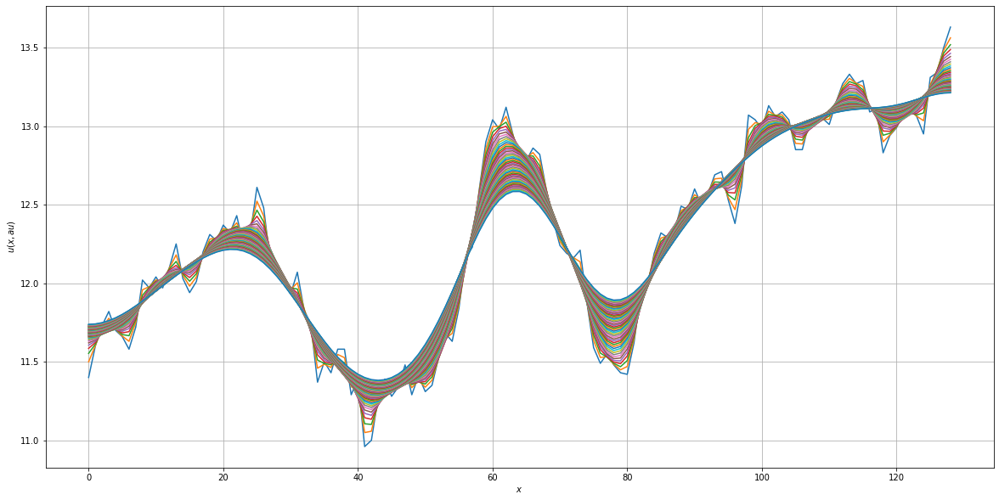
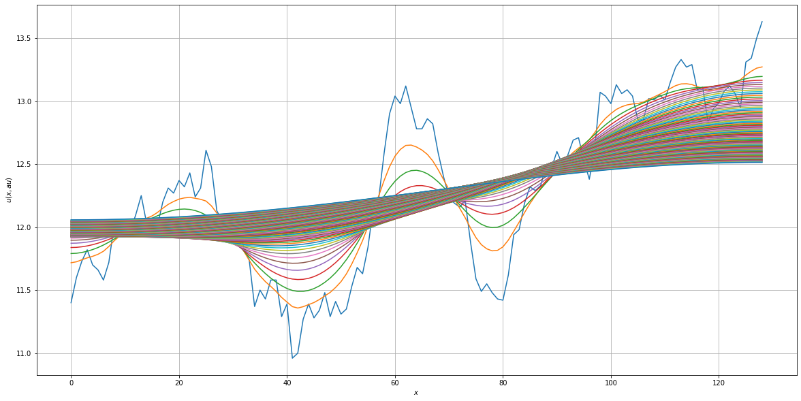
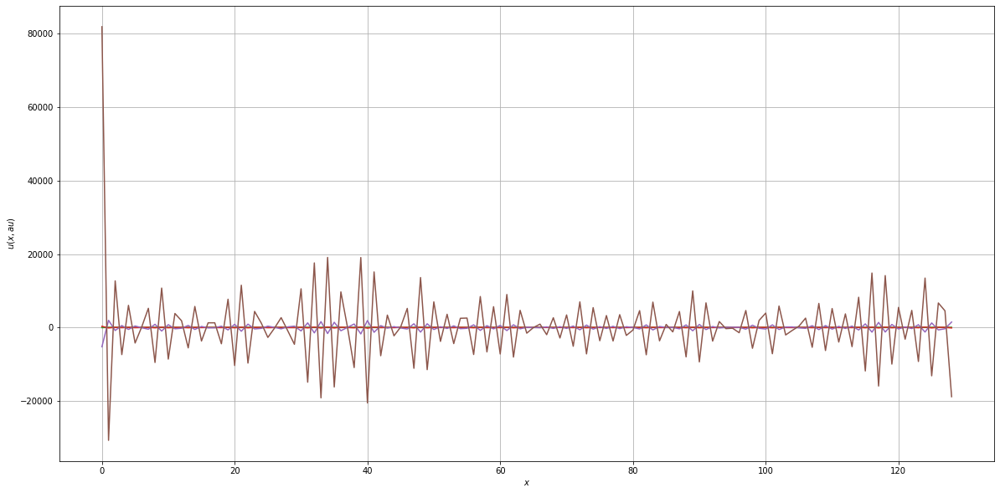

# Smoothing Using the Heat Equation
*Daniel McNulty II*

The heat equation is a parabolically shaped partial differential equation that describes the distribution of heat over time. This project explores how the heat equation known from physics can be used directly to smooth stock data.

Specifically, this project

- Tests the effect of changing the number of iterations (M) and kappa $\left( \kappa \right)$ on the output of the backward (implicit) method with Dirichlet boundary conditions code posted on Courseworks and in the project code from 2018.
- Shows the derivation of the Neumann boundary conditions, implements them for the backward (implicit) method, and tests the effects of changing the number of iterations (M) and kappa $\left( \kappa \right)$ on the implicit method with Neumann boundary condition code output.
- Visualizes the difference between the implicit method with Dirchlet and Neumann boundary condition stock price curves and examines the effects of changing the number of iterations (M) and kappa $\left( \kappa \right)$ on the difference between the Dirchlet and Neumann boundary condition stock price curves.


Then, within the appendices, this project looks at

- The implementation of the forward (explicit) method with Neumann boundary conditions and tests the effects of changing the number of iterations (M) and kappa $\left( \kappa \right)$ on its stability as well as compares the output of the implicit and explicit methods with Neumann boundary conditions.
- An attempt to implement the implicit method with Neumann boundary conditions using the method of sweeps utilized for the implicit method with Dirichlet boundary conditions code provided initially and the flaws in the current implementation.


## Loading Libraries and Setting Initial Parameters
Firstly, the different packages are imported.


```python
import numpy as np
import matplotlib.pyplot as plt
import matplotlib
import pandas as pd
```

Next, the following parameters are specified. The project is set to begin at a = 0 and end at b = 1. Kappa is initially set to 0.001 and T = 1. 


```python
a = 0 # "start"
b = 1 # "end"

kappa = 0.001 # how much we let the extreme points affect the smoothing
T = 1 # the length of the simulation - for how long are we running the smoothing / how long will the simulation take
```

## Handling Stock Price Data

To test smoothing via. the heat equation on different initial conditions I use daily close price time series data from stocks and exchange rates. The initial condition is the stock price movement over time and this is then smoothed through the heat equation. One could use any type of time series data available. 

### Stock prices

The following stock prices are from June 17th 2019 to December 17th, 2019 (equivalent to approx. 129 trading days) and were imported form Yahoo Finance. These stock prices include:

- COSTCO Stock
- JC Penney Stock
- Apple Stock
- Tesla Stock
- Credit Suisse Stock


#### Importing stock prices:


```python
# COSTCO STOCK
COST = pd.read_csv('COST.csv')

# JC PENNEY STOCK
JCP = pd.read_csv('JCP.csv')

# APPLE STOCK
AAPL = pd.read_csv('AAPL.csv')

# TESLA STOCK
TSLA = pd.read_csv('TSLA.csv')

# CREDIT SUISSE STOCK
CS = pd.read_csv('CS.csv')
```

#### Function to Reformat Stock Data for FDM Functions


```python
def Stock(stock):
    u = np.array(stock.Close)
    x = np.arange(len(u))
    return x, u
```

## Implicit Method with Dirichlet Conditions

### Dirchlet Boundary Condition Code

#### Setting Up the Diagonals Function

We set up the diagonals with Dirichlet boundary conditions for the implicit finite difference scheme. We specify the value at the boundary points by forcing the two points outside the matrix to be 0 and the first and last point in the diagonal to be 1.


```python
def setUpDirichletDiagonals(N, rho):
    
    # lower, diagonal, upper
    l = np.zeros((N,1))
    d = np.zeros((N,1))
    u = np.zeros((N,1))
    
    for i in range(N):
        l[i] = -rho
        d[i] = 1 + 2*rho
        u[i] = -rho
    
    # Dirichlet boundary contitions: 
    u[0] = 0  # first point in upper
    l[-2] = 0 # last point in lower
    d[0] = 1  # first point in diagonal
    d[-1] = 1 # last point in diagonal
    
    return l, d, u
```

#### Tri-Diagonal Solver for Implicit Scheme

Solves the system of equations that setUpDiagonals(N) gives us.


```python
def diagSolver(l, d, u, b):
    
    N = len(d)
    lL, dD, uU, bB = map(np.array, (l, d, u, b)) # copy arrays
    for i in range(1, N):
        tmp = lL[i-1]/dD[i-1]
        dD[i] = dD[i] - tmp*uU[i-1] 
        bB[i] = bB[i] - tmp*bB[i-1]
       
    x = dD
    x[-1] = bB[-1]/dD[-1]
    
    for il in range(N-2, -1, -1):
        x[il] = (bB[il]-uU[il]*x[il+1])/dD[il]

    return x
```

#### Main Dirichlet Function


```python
def Dirichlet(Stock_or_Rate, M, plot=True):
    # M = number of simulations/iterations - if M is large enough it will go very little ahead in time for each iteration
    
    x, u = Stock(Stock_or_Rate) # Stock Prices
    res = np.zeros((len(u), M)) # Initialize matrix res, which holds the vector of stock prices generated for each iteration
    u0 = u[0]
    uend = u[-1]

    N = len(u) # set N equal to the length of the u-vector

    dX = (b-a)/N # the distance between each closing price - i.e. time between daily closing prices
    dT = T/M # the distance in time between each iteration

    rho = kappa*dT/(dX*dX)

    lL, dD, uU = setUpDirichletDiagonals(N, rho) 
    
    if plot:
        plt.figure(figsize=(20,10))  
        plt.plot(x, u)

    for j in range(M):
        u[0]=u0
        u[-1]=uend
        u = diagSolver(lL, dD, uU, u)
        
        tmp = np.reshape(u, 129) # Shape the vector of stock prices generated for this iteration to (129,)
        res[:,j] = tmp # Store the vector of stock prices generated for this iteration in column j of matrix res
        
        if plot:
            plt.plot(x, u)
            plt.grid(True)
            plt.xlabel('$x$')
            plt.ylabel('$u(x,\tau$)')
    
    if plot:
        plt.show()
    
    return(res[:,M-1]) # Return the last column of matrix res (The vector of prices from the final iteration)
```

### Dirichlet Function Plot Output

#### COSTCO Stock


```python
cd=Dirichlet(COST, 100)
```


    

    


#### JC Penney Stock


```python
jd=Dirichlet(JCP, 100)
```


    

    


#### Apple Stock


```python
ad = Dirichlet(AAPL, 100)
```


    

    


#### Tesla Stock


```python
td = Dirichlet(TSLA, 100)
```


    

    


#### Credit Suisse Stock


```python
csd = Dirichlet(CS, 100)
```


    

    


### Effect of Changing the Number of Iterations (M) for Dirichlet Boundary Conditions
Increasing the number of iterations used improves the smoothing. This is shown in the plots below, which show the heat equation smoothing of Credit Suisse stock under constant initial conditons for 1, 5, 10, 50, 100, 500, 1000, and 5000 iterations.

#### M = 1


```python
mtd1 = Dirichlet(CS, 1)
```


    

    


#### M = 5


```python
mtd2 = Dirichlet(CS, 5)
```


    

    


#### M = 10


```python
mtd3 = Dirichlet(CS, 10)
```


    

    


#### M = 50


```python
mtd4 = Dirichlet(CS, 50)
```


    

    


#### M = 100


```python
mtd5 = Dirichlet(CS, 100)
```


    

    


#### M = 500


```python
mtd6 = Dirichlet(CS, 500)
```


    

    


#### M = 1000


```python
mtd7 = Dirichlet(CS, 1000)
```


    

    


#### M = 5000


```python
mtd8 = Dirichlet(CS, 5000)
```


    

    


### Effect of Changing Kappa $\left( \kappa \right)$ for Dirichlet Boundary Conditions
Increasing the value of $\kappa$ enhances smoothing; however, using too large a $\kappa$ can cause too much smoothing to the point that the heat equation smoothing converges to a straight line connecting the end points of the true price curve. This is to be expected since the Dirichlet boundary conditions lock the ends of the smoothed curve to the end points of the true stock price curve by definition. On the other hand, using too small a value for $\kappa$ will lead to very little smoothing, to the point that the smoothed curve will converge to the true stock price curve.

The following plots show the heat equation smoothing of the Credit Suisse stock price using $\kappa$ values of 0.00001, 0.0001, 0.001, 0.01, 0.1, 1, 10, 100, and 1000, holding all other parameters constant and using only 100 iterations for each.

#### $\kappa$ = 0.00001


```python
kappa = 0.00001
ktd9 = Dirichlet(CS, 100)
```


    

    


#### $\kappa$ = 0.0001


```python
kappa = 0.0001
ktd8 = Dirichlet(CS, 100)
```


    

    


#### $\kappa$ = 0.001


```python
kappa = 0.001
ktd7 = Dirichlet(CS, 100)
```


    

    


#### $\kappa$ = 0.01


```python
kappa = 0.01
ktd6 = Dirichlet(CS, 100)
```


    

    


#### $\kappa$ = 0.1


```python
kappa = 0.1
ktd5 = Dirichlet(CS, 100)
```


    

    


#### $\kappa$ = 1


```python
kappa = 1
ktd4 = Dirichlet(CS, 100)
```


    

    


#### $\kappa$ = 10


```python
kappa = 10
ktd3 = Dirichlet(CS, 100)
```


    

    


#### $\kappa$ = 100


```python
kappa = 100
ktd2 = Dirichlet(CS, 100)
```


    

    


#### $\kappa$ = 1000


```python
kappa = 1000
ktd1 = Dirichlet(CS, 100)
```


    

    


## Implicit Method with Neumann Conditions

### Backward (Implicit) Method with Neumann Boundary Conditions

The following can be found in the "Derivation of Neumann Boundary Conditions" section of the "Smoothing_With_Heat_Equation-Daniel_McNulty_II.ipynb" file within this repository:

- How the boundaries of the $A_{\text{Explicit}}$ matrix for the forward (explicit) method $A_{\text{Explicit}}\overrightarrow{u}(x_i, \tau_i)=\overrightarrow{u}(x_i, \tau_i+\Delta \tau)$ are found. 
- How once $A_{\text{Explicit}}$ is found, the fact that the implicit method matrix is $A_{\text{implicit}}=2I-A_{\text{Explicit}}$ gives the implicit method matrix

The following plots show and compare The results of Dirichlet and Neumann boundary method functions. Then, in the appendices, the forward method is compared with the backward method using Neumann conditions.

#### Code to set up the $A_{\text{Implicit}}$ Matrix


```python
# Establish the A matrix for implicit scheme with Neumann boundary conditions
def setUpNeumannA(N, rho):
    # Initialize a (N+1) by (N+1) matrix of 0s for A
    A = np.zeros((N+1, N+1))
    
    # Generate the first row of matrix A from the boundary conditions
    A[0][0:3] = [1+((7/2)*rho), (-4*rho), (0.5*rho)]
    # Generate the last row of matrix A from the boundary conditions
    A[N][N-2:N+1] = [(0.5*rho), (-4*rho), (1+(7/2)*rho)]
    # Fill in the rest of the A matrix as expected for the implicit method
    for i in range(0,N-1):
        j = i+1
        A[j][j-1:j+2] = [-rho, (1+(2*rho)), -rho]
    
    return(A)
```

#### Main Neumann Function for Backward (Implicit) Method


```python
def Neumann(Stock_or_Rate, M, plot=True):
    # M = number of simulations/iterations - if M is large enough it will go very little ahead in time for each iteration
    
    x, u = Stock(Stock_or_Rate) # Stock Prices
    #x, u = Rate(Stock_or_Rate) # Exchange Rates
    res = np.zeros((len(u), M)) # Initialize matrix res, which holds the vector of stock prices generated for each iteration
    
    # Set N equal to 1 less than the length of the u-vector
    N = len(u)-1
       
    dX = (b-a)/N # the distance between each closing price - i.e. time between daily closing prices
    dT = T/M # the distance in time between each iteration
    rho = kappa*dT/(dX*dX)
    
    A = setUpNeumannA(N, rho)
    
    if plot:
        plt.figure(figsize=(20,10))  
        plt.plot(x, u)

    for j in range(M):
        u = np.linalg.solve(A, u)
        res[:,j] = u # Store the vector of stock prices generated for this iteration in column j of matrix res
        
        if plot:
            plt.plot(x, u)
            plt.grid(True)
            plt.xlabel('$x$')
            plt.ylabel('$u(x,\tau)$')
    
    if plot:
        plt.show()
    
    return(res[:,M-1]) # Return the last column of matrix res (The vector of prices from the final iteration)
```

### Test Neumann Conditions for Backward (Implicit) Method Function Plot Output

#### Reset to Initial Parameters


```python
a = 0 # "start"
b = 1 # "end"

kappa = 0.001 # how much we let the extreme points affect the smoothing
T = 1 # the length of the simulation - for how long are we running the smoothing / how long will the simulation take
```

#### Costco Stock


```python
cn=Neumann(COST, 100)
```


    

    


#### JC Penney Stock


```python
jn=Neumann(JCP,100)
```


    

    


#### Apple Stock


```python
an = Neumann(AAPL, 100)
```


    

    


#### Tesla Stock


```python
tn = Neumann(TSLA, 100)
```


    

    


#### Credit Suisse Stock


```python
csn = Neumann(CS, 100)
```


    

    


### Effect of Changing the Number of Iterations (M) for Backward (Implicit) Method with Neumann Boundary Conditions
As with Dirichlet boundary conditions, increasing the number of iterations used improves the smoothing. This is shown in the plots below, which show the heat equation smoothing of Credit Suisse stock under constant initial conditons for 1, 5, 10, 50, 100, 500, 1000, and 5000 iterations.

#### M = 1


```python
mtn1 = Neumann(CS, 1)
```


    

    


#### M = 5


```python
mtn2 = Neumann(CS, 5)
```


    

    


#### M = 10


```python
mtn3 = Neumann(CS, 10)
```


    

    


#### M = 50


```python
mtn4 = Neumann(CS, 50)
```


    

    


#### M = 100


```python
mtn5 = Neumann(CS, 100)
```


    

    


#### M = 500


```python
mtn6 = Neumann(CS, 500)
```


    

    


#### M = 1000


```python
mtn7 = Neumann(CS, 1000)
```


    

    


#### M = 5000


```python
mtn8 = Neumann(CS, 5000)
```


    

    


### Effect of Changing Kappa $\left( \kappa \right)$ for Backward (Implicit) Method with Neumann Boundary Conditions
As with Dirichlet conditions, increasing the value of $\kappa$ enhances smoothing; however, using too large a $\kappa$ can cause too much smoothing to the point that the heat equation smoothing converges to a straight, horizontal line corresponding to the average price of the price curve. On the other hand, using too small a value for $\kappa$ will lead to very little smoothing, to the point that the smoothed curve will converge to the true stock price curve.

The following plots show the heat equation smoothing of the Credit Suisse stock price using $\kappa$ values of 0.00001, 0.0001, 0.001, 0.01, 0.1, 1, 10, 100, and 1000, holding all other parameters constant and using only 100 iterations for each.

#### $\kappa$ = 0.00001


```python
kappa = 0.00001
ktn9 = Neumann(CS, 100)
```


    

    


#### $\kappa$ = 0.0001


```python
kappa = 0.0001
ktn8 = Neumann(CS, 100)
```


    

    


#### $\kappa$ = 0.001


```python
kappa = 0.001
ktn7 = Neumann(CS, 100)
```


    

    


#### $\kappa$ = 0.01


```python
kappa = 0.01
ktn6 = Neumann(CS, 100)
```


    

    


#### $\kappa$ = 0.1


```python
kappa = 0.1
ktn5 = Neumann(CS, 100)
```


    

    


#### $\kappa$ = 1


```python
kappa = 1
ktn4 = Neumann(CS, 100)
```


    

    


#### $\kappa$ = 10


```python
kappa = 10
ktn3 = Neumann(CS, 100)
```


    

    


#### $\kappa$ = 100


```python
kappa = 100
ktn2 = Neumann(CS, 100)
```


    

    


#### $\kappa$ = 1000


```python
kappa = 1000
ktn1 = Neumann(CS, 100)
```


    

    


## Comparing the Backward (Implicit) Method with Dirichlet and Neumann Boundary Condition Curves
In order to compare the differences in the curves generated by the Dirichlet and Neumann boundary conditions, the resulting stock price vectors generated by both methods for a given stock using 100 iterations were combined into a dataframe along with the absolute difference between the prices generated by the two methods. This dataframe is shown for each trial and the curves generated by both methods were plotted together as well.

### Reset to Initial Parameters


```python
a = 0 # "start"
b = 1 # "end"

kappa = 0.001 # how much we let the extreme points affect the smoothing
T = 1 # the length of the simulation - for how long are we running the smoothing / how long will the simulation take
```

### Function to Gather Resulting Dirichlet and Neumann Curves for Input Iterations M


```python
def methodUVals(Ticker, M):
    x = range(1,len(Stock(Ticker)[1])+1)
    ud = Dirichlet(Ticker, M, False)
    un = Neumann(Ticker, M, False)
    absdiff = np.absolute(ud-un)
    
    return(pd.DataFrame({'x':x, 
                         'Dirichlet_Price':ud, 
                         'Neumann_Price':un,
                         '| Dirichlet - Neumann |':absdiff}))
```

### Function to Plot the Dirichlet and Neumann Curves Generated from methodUVals()


```python
def compPlt(df, Ticker=0):    
    plt.figure(figsize=(20,10))  
    p = plt.grid(True)
    p = plt.xlabel('$x$')
    p = plt.ylabel('$u(x,\tau)$')
    
    if isinstance(Ticker, pd.DataFrame):
        u = Stock(Ticker)[1]
        p = plt.plot(df.x, u, 'k-', label='True Stock Price')
      
    p = plt.plot(df.x, df.Dirichlet_Price, 'r-', marker='o', label='Dirichlet Price')
    p = plt.plot(df.x, df.Neumann_Price, 'b-', marker='o', label='Neumann Price')
    p = plt.legend(loc='lower right', fontsize=18)
    
    return(p)
```

### Comparison of Dirichlet and Neumann Curves Generated for the same Stock with the same Number of Iterations
The results of this comparison show that starting and ending points of each curve differ, as would be expected since the Dirichlet boundary conditions specify the start and end price explicitly at the boundaries whereas the Neumann boundary conditions specify the partial derivative of the price at the boundaries. 

The results of this comparison also show that the difference between the estimates in the middle of the Dirichlet and Neumann boundary condition curves is very small. These differences are so small that, when the curves generated by the two different methods are plotted, the two curves appear to overlap. This is also to be expected.

#### JC Penney Stock


```python
JCP_comp = methodUVals(JCP, 100)
compPlt(JCP_comp, JCP)
JCP_comp.iloc[range(0,130,10)].style.hide_index()
```


    


#### Costco Stock


```python
COST_comp = methodUVals(COST, 100)
compPlt(COST_comp, COST)
COST_comp.iloc[range(0,130,10)].style.hide_index()
```


    

    


#### Apple Stock


```python
AAPL_comp = methodUVals(AAPL, 100)
compPlt(AAPL_comp, AAPL)
AAPL_comp.iloc[range(0,130,10)].style.hide_index()
```


    


#### Tesla Stock


```python
TSLA_comp = methodUVals(TSLA, 100)
compPlt(TSLA_comp, TSLA)
TSLA_comp.iloc[range(0,130,10)].style.hide_index()
```


    


#### Credit Suisse Stock


```python
CS_comp = methodUVals(CS, 100)
compPlt(CS_comp, CS)
CS_comp.iloc[range(0,130,10)].style.hide_index()
```

    

    


### Effect of the Number of Iterations (M) on the Difference between the Dirichlet and Neumann Curves Generated for the same Stock
As the number of iterations used increases, the differences between the middle points of the Dirichlet and Neumann curves decrease, while the differences between the points close to the boundaries of the Dirichlet and Neumann curves appear to converge to a constant number. This is shown in the plots below, which show the curves generated by the heat equation smoothing of Credit Suisse stock under Dirichlet and Neumann boundary conditions with constant parameters for 1, 5, 10, 50, 100, 500, 1000, and 5000 iterations.


#### M = 1

```python
CS_comp1 = methodUVals(CS, 1)
compPlt(CS_comp1)
CS_comp1.iloc[range(0,130,10)].style.hide_index()
```


    

    


#### M = 5

```python
CS_comp2 = methodUVals(CS, 5)
compPlt(CS_comp2)
CS_comp2.iloc[range(0,130,10)].style.hide_index()
```


    

    

#### M = 10

```python
CS_comp3 = methodUVals(CS, 10)
compPlt(CS_comp3)
CS_comp3.iloc[range(0,130,10)].style.hide_index()
```


    

    

#### M = 50

```python
CS_comp4 = methodUVals(CS, 50)
compPlt(CS_comp4)
CS_comp4.iloc[range(0,130,10)].style.hide_index()
```


    

    


#### M = 100

```python
CS_comp5 = methodUVals(CS, 100)
compPlt(CS_comp5)
CS_comp5.iloc[range(0,130,10)].style.hide_index()
```


    

    


#### M = 500

```python
CS_comp6 = methodUVals(CS, 500)
compPlt(CS_comp6)
CS_comp6.iloc[range(0,130,10)].style.hide_index()
```


    

    


#### M = 1000

```python
CS_comp7 = methodUVals(CS, 1000)
compPlt(CS_comp7)
CS_comp7.iloc[range(0,130,10)].style.hide_index()
```


    

    


#### M = 5000

```python
CS_comp8 = methodUVals(CS, 5000)
compPlt(CS_comp8)
CS_comp8.iloc[range(0,130,10)].style.hide_index()
```


    

    


### Effect of Kappa $\kappa$ on the Difference between the Dirichlet and Neumann Curves Generated for the same Stock
Increasing the value of $\kappa$ increases the difference between the Dirichlet and Neumann boundary condition curves. This is to be expected, as it was shown in the $\kappa$ effect plots for each method that

* For both Dirichlet and Neumann boundary condition curves, using too small a value for $\kappa$ will lead to very little smoothing to the point that both converge to the true stock price curve.
* Using too large a $\kappa$ can cause too much smoothing for both Dirichlet and Neumann boundary condition curves; however, the different boundary conditions converge to different curves from this.
    - The Dirichlet boundary condition curve will converge to a straight line connecting the first and last points of the true price curve.
    - The Neumann boundary condition curve will converge to a straight, horizontal line corresponding to the average price of the true price curve.

As such, both the Dirichlet and Neumann boundary condition curves for low values of $\kappa$ will mostly follow along with the true stock price curve and so the difference between the points of the two will be very low. However, as $\kappa$ is increased, the Dirichlet and Neumann boundary condition curves will begin to differentiate from one another based on their boundary conditions. Finally, when $\kappa$ is raised to a high enough level, the differences between the points of the Dirichlet and Neumann boundary condition curves will become significant even at the midpoints as the Dirchlet and Neumann boundary condition curves converge to different straight lines with one intersection.

The following plots show the heat equation smoothing using both Dirichlet and Neumann boundary condition curves of the Credit Suisse stock price using $\kappa$ values of 0.00001, 0.0001, 0.001, 0.01, 0.1, 1, 10 holding all other parameters constant and using only 100 iterations for each.

#### $\kappa$ = 0.00001


```python
kappa = 0.00001
CS_compk1 = methodUVals(CS, 100)
compPlt(CS_compk1)
CS_compk1.iloc[range(0,130,10)].style.hide_index()
```


    

    


#### $\kappa$ = 0.0001


```python
kappa = 0.0001
CS_compk2 = methodUVals(CS, 100)
compPlt(CS_compk2)
CS_compk2.iloc[range(0,130,10)].style.hide_index()
```


    

    


#### $\kappa$ = 0.001


```python
kappa = 0.001
CS_compk3 = methodUVals(CS, 100)
compPlt(CS_compk3)
CS_compk3.iloc[range(0,130,10)].style.hide_index()
```


    

    


#### $\kappa$ = 0.01


```python
kappa = 0.01
CS_compk4 = methodUVals(CS, 100)
compPlt(CS_compk4)
CS_compk4.iloc[range(0,130,10)].style.hide_index()
```


    

    


#### $\kappa$ = 0.1


```python
kappa = 0.1
CS_compk5 = methodUVals(CS, 100)
compPlt(CS_compk5)
CS_compk5.iloc[range(0,130,10)].style.hide_index()
```


    

    


#### $\kappa$ = 1


```python
kappa = 1
CS_compk5 = methodUVals(CS, 100)
compPlt(CS_compk5)
CS_compk5.iloc[range(0,130,10)].style.hide_index()
```


    

    


#### $\kappa$ = 10


```python
kappa = 1
CS_compk6 = methodUVals(CS, 100)
compPlt(CS_compk6)
CS_compk6.iloc[range(0,130,10)].style.hide_index()
```


    

    


## Conclusions
From the work done in this project, the following results were obtained

### Dirichlet Boundary Conditions
- As the number of iterations increases, the smoothing is enhanced
- As the $\kappa$ value increases, the smoothing is enhanced; however, if increased too much, there is risk of over-smoothing to the point that the smoothed curve is a straight line connecting the start and end stock prices of the true stock price curve.
- As the $\kappa$ value decreases, the smoothing is decreased and, if $\kappa$ is decreased too much, the curve generated by the Dirichlet boundary conditions will converge with the true stock price curve.

### Neumann Boundary Conditions
- As the number of iterations increases, the smoothing is enhanced
- As the $\kappa$ value increases, the smoothing is enhanced; however, if increased too much, there is risk of over-smoothing to the point that the smoothed curve is a straight, horizontal line with a vertical value equal to the average of the true stock price curve.
- As the $\kappa$ value decreases, the smoothing is decreased and, if $\kappa$ is decreased too much, the curve generated by the Dirichlet boundary conditions will converge with the true stock price curve.

### Difference between Dirichlet and Neumann Boundary Conditions
- As the number of iterations increases, the differences between the middle points of the Dirichlet and Neumann boundary condition curves decrease, while the points close to the boundary appear to converge to a constant.
- As the $\kappa$ value increases, the differences between the points of the Dirichlet and Neumann boundary condition curves generally increase.

## Future Work
Potential extensions of this project include
- Implementing forward (explicit) and/or Crank-Nicholson methods to compare with the backward (implicit) method (See appendices 1 and 2 for an example of this).
- Implementing the implicit method with Neumann boundary conditions using the method of sweeps rather than using matrix solver from NumPy (See appendix 3 for an attempt at this).
- Extending the Neumann boundary conditions to incorporate a larger number of points.
- Combining Dirichlet and Neumann boundary conditions (ie. Setting the left boundary to a Dirichlet condition and the right boundary to a Neumann condition, use Dirichlet for the first 5 iterations and Neumann for iterations beyond 5, etc.) and seeing how that impacts the generated stock price curves.

## Appendix 1: Forward (Explicit) Method using Neumann Boundary Conditions

In this section, the $A_{\text{Explicit}}$ matrix will be set up and used to implement the forward (implicit) method $A_{\text{Explicit}}\overrightarrow{u}(x_i, \tau_i)=\overrightarrow{u}(x_i, \tau_i+\Delta \tau)$ using Neumann boundary conditions. The $A_{\text{Explicit}}$ matrix is covered in more detail within the "Smoothing_With_Heat_Equation-Daniel_McNulty_II.ipynb" file in this repository.

### Implementation

#### Code to Set Up the $A_{Explicit}$ Matrix


```python
# Establish the A matrix for implicit scheme with Neumann boundary conditions
def setUpExplicitNeumannA(N, rho):
    # Initialize a (N+1) by (N+1) matrix of 0s for A
    A = np.zeros((N+1, N+1))
    
    # Generate the first row of matrix A from the boundary conditions
    A[0][0:3] = [1-((7/2)*rho), (4*rho), (-0.5*rho)]
    # Generate the last row of matrix A from the boundary conditions
    A[N][N-2:N+1] = [(-0.5*rho), (4*rho), (1-(7/2)*rho)]
    # Fill in the rest of the A matrix as expected for the implicit method
    for i in range(0,N-1):
        j = i+1
        A[j][j-1:j+2] = [rho, (1-(2*rho)), rho]
    
    return(A)
```

#### Main Neumann Function for Forward (Explicit) Method


```python
def ExplicitNeumann(Stock_or_Rate, M, plot=True):
    # M = number of simulations/iterations - if M is large enough it will go very little ahead in time for each iteration
    
    x, u = Stock(Stock_or_Rate) # Stock Prices
    #x, u = Rate(Stock_or_Rate) # Exchange Rates
    res = np.zeros((len(u), M)) # Initialize matrix res, which holds the vector of stock prices generated for each iteration
    
    # Set N equal to 1 less than the length of the u-vector
    N = len(u)-1
       
    dX = (b-a)/N # the distance between each closing price - i.e. time between daily closing prices
    dT = T/M # the distance in time between each iteration
    rho = kappa*dT/(dX*dX)
    
    A = setUpExplicitNeumannA(N, rho)
    
    if plot:
        plt.figure(figsize=(20,10))  
        plt.plot(x, u)

    for j in range(M):
        u = np.matmul(A, u)
        res[:,j] = u # Store the vector of stock prices generated for this iteration in column j of matrix res
        
        if plot:
            plt.plot(x, u)
            plt.grid(True)
            plt.xlabel('$x$')
            plt.ylabel('$u(x,\tau)$')
    
    if plot:
        plt.show()
    
    # Return the last column of matrix res (The vector of prices from the final iteration)
    return(res[:,M-1])
```

### Test Neumann Conditions on Forward (Explicit) Method Function Plot Output

#### Reset to Initial Parameters


```python
a = 0 # "start"
b = 1 # "end"

kappa = 0.001 # how much we let the extreme points affect the smoothing
T = 1 # the length of the simulation - for how long are we running the smoothing / how long will the simulation take
```

#### Costco Stock


```python
cne = ExplicitNeumann(COST, 100)
```


    

    


#### JC Penney Stock


```python
jne = ExplicitNeumann(JCP,100)
```


    

    


#### Apple Stock


```python
ape = ExplicitNeumann(AAPL, 100)
```


    

    


#### Tesla Stock


```python
tne = ExplicitNeumann(TSLA, 100)
```


    

    


#### Credit Suisse Stock


```python
csne = ExplicitNeumann(CS, 100)
```


    

    


### Effect of Changing the Number of Iterations (M) for Forward (Explicit) Method with Neumann Boundary Conditions

In general it can be seen that as the number of iterations increases, the smoothing also increases. However, unlike the backward (implicit) method which is unconditionally stable, the forward (explicit) method is conditionally stable and this property is demonstrated by the use of increasing numbers of iterations. Specifically, using too low a number of iterations causes the explicit method to become unstable.

This is shown in the plots below, which show the heat equation smoothing of Credit Suisse stock under constant initial conditons for 1, 5, 10, 50, 100, 500, 1000, and 5000 iterations.

#### M = 1


```python
mtne1 = ExplicitNeumann(CS, 1)
```


    

    


#### M = 5


```python
mtne2 = ExplicitNeumann(CS, 5)
```


    

    


#### M = 10


```python
mtne3 = ExplicitNeumann(CS, 10)
```


    

    


#### M = 50


```python
mtne4 = ExplicitNeumann(CS, 50)
```


    

    


#### M = 100


```python
mtne5 = ExplicitNeumann(CS, 100)
```


    

    


#### M = 500


```python
mtne6 = ExplicitNeumann(CS, 500)
```


    

    


#### M = 1000


```python
mtne7 = ExplicitNeumann(CS, 1000)
```


    

    


#### M = 5000


```python
mtne8 = ExplicitNeumann(CS, 5000)
```


    

    


### Effect of Changing Kappa $\left( \kappa \right)$ for Forward (Explicit) Method with Neumann Boundary Conditions

Increasing the value of $\kappa$ enhances smoothing; however, using too large a $\kappa$ causes the forward (explicit) method to become unstable. On the other hand, using too small a value for  𝜅  will lead to very little smoothing, to the point that the smoothed curve will converge to the true stock price curve.

This is shown in the plots below, which show the heat equation smoothing of Credit Suisse stock under constant initial conditons using $\kappa$ values of 0.00001, 0.0001, 0.001, 0.01, 0.1, and 1.

#### $\kappa$ = 0.00001


```python
kappa = 0.00001
ktne9 = ExplicitNeumann(CS, 100)
```


    

    


#### $\kappa$ = 0.0001


```python
kappa = 0.0001
ktne8 = ExplicitNeumann(CS, 100)
```


    

    


#### $\kappa$ = 0.001


```python
kappa = 0.001
ktne7 = ExplicitNeumann(CS, 100)
```


    

    


#### $\kappa$ = 0.01


```python
kappa = 0.01
ktne6 = ExplicitNeumann(CS, 100)
```


    

    


#### $\kappa$ = 0.1


```python
kappa = 0.1
ktne5 = ExplicitNeumann(CS, 100)
```


    

    


#### $\kappa$ = 1


```python
kappa = 1
ktne4 = ExplicitNeumann(CS, 100)
```


    

    


## Appendix 2: Comparison of Forward (Explicit) Method and Backward (Implicit) Method using Neumann Boundary Conditions

### Reset to Initial Parameters


```python
a = 0 # "start"
b = 1 # "end"

kappa = 0.001 # how much we let the extreme points affect the smoothing
T = 1 # the length of the simulation - for how long are we running the smoothing / how long will the simulation take
```

### Function to Gather Resulting Forward (Explicit) and Backward (Implicit) Method Curves for Input Iterations M


```python
def NeumannMethodUVals(Ticker, M):
    x = range(1,len(Stock(Ticker)[1])+1)
    uf = ExplicitNeumann(Ticker, M, False)
    ub = Neumann(Ticker, M, False)
    absdiff = np.absolute(uf-ub)
    
    return(pd.DataFrame({'x':x, 
                         'Explicit_Price':uf, 
                         'Implicit_Price':ub,
                         '| Explicit - Implicit |':absdiff}))
```

### Function to Plot the Forward (Explicit) and Backward (Implicit) Method Curves Generated from NeumannMethodUVals()


```python
def compPlt(df, Ticker=0):    
    plt.figure(figsize=(20,10))  
    p = plt.grid(True)
    p = plt.xlabel('$x$')
    p = plt.ylabel('$u(x,\tau)$')
    
    if isinstance(Ticker, pd.DataFrame):
        u = Stock(Ticker)[1]
        p = plt.plot(df.x, u, 'k-', label='True Stock Price')
      
    p = plt.plot(df.x, df.Explicit_Price, 'r-', marker='o', label='Explicit Price')
    p = plt.plot(df.x, df.Implicit_Price, 'b-', marker='o', label='Implicit Price')
    p = plt.legend(loc='lower right', fontsize=18)
    
    return(p)
```

### Comparison of Forward (Explicit) and Backward (Implicit) Method Curves Generated for the same Stock with the same Number of Iterations

The prices calculated using the forward (explicit) and backward (implicit) methods match closely under identical parameter conditions where the explicit method is stable.

#### JC Penney Stock


```python
JCP_comp2 = NeumannMethodUVals(JCP, 100)
compPlt(JCP_comp2, JCP)
JCP_comp2.iloc[range(0,130,10)].style.hide_index()
```


    

    


#### Costco Stock


```python
COST_comp2 = NeumannMethodUVals(COST, 100)
compPlt(COST_comp2, COST)
COST_comp2.iloc[range(0,130,10)].style.hide_index()
```


    

    


#### Apple Stock


```python
AAPL_comp2 = NeumannMethodUVals(AAPL, 100)
compPlt(AAPL_comp2, AAPL)
AAPL_comp2.iloc[range(0,130,10)].style.hide_index()
```


    

    


#### Tesla Stock


```python
TSLA_comp2 = NeumannMethodUVals(TSLA, 100)
compPlt(TSLA_comp2, TSLA)
TSLA_comp2.iloc[range(0,130,10)].style.hide_index()
```


    

    


#### Credit Suisse Stock


```python
CS_comp2 = NeumannMethodUVals(CS, 100)
compPlt(CS_comp2, CS)
CS_comp2.iloc[range(0,130,10)].style.hide_index()
```


    

    


## Appendix 3: Attempt to Apply setUpDiagonals() and DiagSolver() for Backward (Implicit) Method with Neumann Boundary Conditions

Initially, the intention of this project was to implement the backward (implicit) method with Neumann boundary conditions using the same methodology as was used for the implicit method with Dirichlet boundary conditions. However, after many attempts and modifications to make this scheme work, the following implementaton ultimately still proved flawed.

As a result, implementation of the implicit method with Neumann boundary conditions using the numpy linalg solve function was kept in the main body of this project and the attempt to utilize diagonals, now named NeumannWithDiag(), was kept in this appendix. A discussion of the percieved flaws in implementation is also presented.

### Implementation

#### Setting Up the Diagonals Function
Set up the diagonals with Neumann boundary conditions for the implicit finite difference scheme. Specify the values at the boundary points by forcing the initial and final points of all 3 diagonals to the values in the first and last rows of the $A_{Implicit}$ matrix.


```python
def setUpNeumannDiagonals(N, rho):
    
    # lower, diagonal, upper
    l = np.zeros((N,1))
    d = np.zeros((N,1))
    u = np.zeros((N,1))
    
    for i in range(N):
        l[i] = -rho
        d[i] = 1 + 2*rho
        u[i] = -rho
    
    # Neumann boundary contitions: 
    # Left
    u[0] = -4*rho
    d[0] = 1+(7/2)*rho
    l[0] = 0.5*rho
    # Right
    u[-1] = 0.5*rho
    d[-1] = 1+(7/2)*rho
    l[-1] = -4*rho
    
    return l, d, u
```

#### Tri-Diagonal Solver for Implicit Scheme with Neumann Boundary Conditions

Solves the system of equations that setUpDiagonals(N) gives us, using Gaussian elimination to create true upper, middle, and lower diagonals.


```python
def NeumannDiagSolver(l, d, u, b):
    
    N = len(d)
    lL, dD, uU, bB = map(np.array, (l, d, u, b)) # copy arrays
    
    # Upward Gaussian Elimination
    tmp = lL[0]/uU[1]
    dD[0] = dD[0] - tmp*lL[1]
    uU[0] = uU[0] - tmp*dD[1]
    bB[0] = bB[0] - tmp*bB[1]
    
    # Downward Gaussian Elimination
    tmp = u[-1]/l[-2]
    lL[-1] = lL[-1] - tmp*dD[-2]
    dD[-1] = dD[-1] - tmp*uU[-2]
    bB[-1] = bB[-1] - tmp*bB[-2]
    
    for i in range(0, N):
        tmp = lL[i]/dD[i-1]
        dD[i] = dD[i] - tmp*uU[i-1] 
        bB[i] = bB[i] - tmp*bB[i-1]
    
    x = dD
    x[-1] = bB[-1]/dD[-1]
    
    for il in range(N-3, -1, -1):
        x[il] = (bB[il]-uU[il]*x[il+1])/dD[il]
    
    return x
```

#### NeumannWithDiag() Function


```python
def NeumannWithDiag(Stock_or_Rate, M, plot=True):
    # M = number of simulations/iterations - if M is large enough it will go very little ahead in time for each iteration
    
    x, u = Stock(Stock_or_Rate) # Stock Prices
    res = np.zeros((len(u), M)) # Initialize matrix res, which holds the vector of stock prices generated for each iteration
    u0 = u[0]
    uend = u[-1]

    N = len(u) # set N equal to the length of the u-vector

    dX = (b-a)/N # the distance between each closing price - i.e. time between daily closing prices
    dT = T/M # the distance in time between each iteration

    rho = kappa*dT/(dX*dX)

    lL, dD, uU = setUpNeumannDiagonals(N, rho) 
    
    if plot:
        plt.figure(figsize=(20,10))  
        plt.plot(x, u)

    for j in range(M):
        u[0]=u0
        u[-1]=uend
        u = NeumannDiagSolver(lL, dD, uU, u)
        
        tmp = np.reshape(u, 129) # Shape the vector of stock prices generated for this iteration to (129,)
        res[:,j] = tmp # Store the vector of stock prices generated for this iteration in column j of matrix res
        
        if plot:
            plt.plot(x, u)
            plt.grid(True)
            plt.xlabel('$x$')
            plt.ylabel('$u(x,\tau)$')
    
    if plot:
        plt.show()
    
    return(res[:,M-1]) # Return the last column of matrix res (The vector of prices from the final iteration)
```

### Test Plot Output of NeumannWithDiag()

The below plots show sample plot output from NeumannWithDiag() for each stock using 1 iteration. Each appears to work as expected, with the end points not anchored to the end points of the true stock price curve. The following sections show how changing the number of iterations (M) and the kappa value $(\kappa)$ cause problems with this current implementation.

#### Reset to Initial Parameters


```python
a = 0 # "start"
b = 1 # "end"

kappa = 0.001 # how much we let the extreme points affect the smoothing
T = 1 # the length of the simulation - for how long are we running the smoothing / how long will the simulation take
```

#### COSTCO stock


```python
cost_nwd1 = NeumannWithDiag(COST, 1)
```


    

    


#### JC Penney Stock


```python
jcp_nwd1 = NeumannWithDiag(JCP, 1)
```


    

    


#### Apple Stock


```python
aapl_nwd1 = NeumannWithDiag(AAPL, 1)
```


    

    


#### Tesla Stock


```python
tsla_nwd1 = NeumannWithDiag(TSLA, 1)
```


    

    


#### Credit Suisse Stock


```python
cs_nwd1 = NeumannWithDiag(CS, 1)
```


    

    


### Effect of Changing the Number of Iterations (M) for NeumannWithDiag()

As the number of iterations M used increases, all of the output points of NeumannWithDiag() appear to converge with the output of the implicit method function with Dirichlet boundary conditions. While this is to be expected for the middle points of the output curve, this should not be the case for the points close to the left and right boundaries of the output curves.

This behavior is demonstrated in the plots below, which include the

- The heat equation smoothing of Credit Suisse stock using NeumannWithDiag()
- Comparison plots of the NeumannWithDiag() and implicit method using Dirichlet boundary conditions output

under constant initial conditons for 1, 10, 25, 50, 100, 500, and 1000 iterations.

#### Function to Gather Resulting Dirichlet and Neumann Curves for Input Iterations M


```python
def methodDiagUVals(Ticker, M):
    x = range(1,len(Stock(Ticker)[1])+1)
    ud = Dirichlet(Ticker, M, False)
    un = NeumannWithDiag(Ticker, M, False)
    absdiff = np.absolute(ud-un)
    
    return(pd.DataFrame({'x':x, 
                         'Dirichlet_Price':ud, 
                         'Neumann_Price':un,
                         '| Dirichlet - Neumann |':absdiff}))
```

#### Function to Plot the Dirichlet and Neumann Curves Generated from methodUVals()


```python
def compPlt(df, Ticker=0):    
    plt.figure(figsize=(20,10))  
    p = plt.grid(True)
    p = plt.xlabel('$x$')
    p = plt.ylabel('$u(x,\tau)$')
    
    if isinstance(Ticker, pd.DataFrame):
        u = Stock(Ticker)[1]
        p = plt.plot(df.x, u, 'k-', label='True Stock Price')
      
    p = plt.plot(df.x, df.Dirichlet_Price, 'r-', marker='o', label='Dirichlet Price')
    p = plt.plot(df.x, df.Neumann_Price, 'b-', marker='o', label='Neumann Price')
    p = plt.legend(loc='lower right', fontsize=18)
    
    return(p)
```

#### M = 1


```python
nwd1 = NeumannWithDiag(CS, 1)
nwd1_comp = methodDiagUVals(CS, 1)
compPlt(nwd1_comp)
nwd1_comp.iloc[range(0,130,10)].style.hide_index()
```


    

    


    


#### M = 10


```python
nwd3 = NeumannWithDiag(CS, 10)
nwd3_comp = methodDiagUVals(CS, 1)
compPlt(nwd3_comp)
nwd3_comp.iloc[range(0,130,10)].style.hide_index()
```


    

    

    

    


#### M = 25


```python
nwd4 = NeumannWithDiag(CS, 25)
nwd4_comp = methodDiagUVals(CS, 25)
compPlt(nwd4_comp)
nwd4_comp.iloc[range(0,130,10)].style.hide_index()
```


    

    

    

    


#### M = 50


```python
nwd5 = NeumannWithDiag(CS, 50)
nwd5_comp = methodDiagUVals(CS, 50)
compPlt(nwd5_comp)
nwd5_comp.iloc[range(0,130,10)].style.hide_index()
```


    


    

    


#### M = 100


```python
nwd6 = NeumannWithDiag(CS, 100)
nwd6_comp = methodDiagUVals(CS, 100)
compPlt(nwd6_comp)
nwd6_comp.iloc[range(0,130,10)].style.hide_index()
```


    

    

    

    


#### M = 500


```python
nwd7 = NeumannWithDiag(CS, 500)
nwd7_comp = methodDiagUVals(CS, 500)
compPlt(nwd7_comp)
nwd7_comp.iloc[range(0,130,10)].style.hide_index()
```


    

    


    

    


#### M = 1000


```python
nwd8 = NeumannWithDiag(CS, 1000)
nwd8_comp = methodDiagUVals(CS, 1000)
compPlt(nwd8_comp)
nwd8_comp.iloc[range(0,130,10)].style.hide_index()
```


    

    

    

    


### Effect of Changing Kappa $\left( \kappa \right)$ for NeumannWithDiag()

As is expected, increasing the value of $\kappa$ enhances smoothing; however, using too large a $\kappa$ can cause too much smoothing to the point that the heat equation smoothing converges to a straight, horizontal line corresponding to the average price of the true price curve. On the other hand, using too small a value for $\kappa$ will lead to very little smoothing, to the point that the smoothed curve will converge to the true stock price curve.

What is unexpected in the following plots is how, when using large $\kappa$ values, the convergence to a straight, horizontal line corresponding to the average price of the true price curve takes multiple iterations rather than both beginning and ending on the average price of the true price curve.

This is shown in the plots below, which show the heat equation smoothing of Credit Suisse stock under constant initial conditons using $\kappa$ values of 0.00001, 0.0001, 0.001, 0.01, 0.1, 1, 10, 100, 1000.

#### $\kappa$ = 0.00001


```python
kappa = 0.00001
ktnd9 = NeumannWithDiag(CS, 100)
```


    

    


#### $\kappa$ = 0.0001


```python
kappa = 0.0001
ktnd8 = NeumannWithDiag(CS, 100)
```


    

    


#### $\kappa$ = 0.001


```python
kappa = 0.001
ktnd7 = NeumannWithDiag(CS, 100)
```


    

    


#### $\kappa$ = 0.01


```python
kappa = 0.01
ktnd6 = NeumannWithDiag(CS, 100)
```


    

    


#### $\kappa$ = 0.1


```python
kappa = 0.1
ktnd5 = NeumannWithDiag(CS, 100)
```


    

    


#### $\kappa$ = 1


```python
kappa = 1
ktnd4 = NeumannWithDiag(CS, 100)
```


    

    


#### $\kappa$ = 10


```python
kappa = 10
ktnd3 = NeumannWithDiag(CS, 100)
```


    

    


#### $\kappa$ = 100


```python
kappa = 100
ktnd2 = NeumannWithDiag(CS, 100)
```


    

    


#### $\kappa$ = 1000


```python
kappa = 1000
ktnd1 = NeumannWithDiag(CS, 100)
```


    

    

